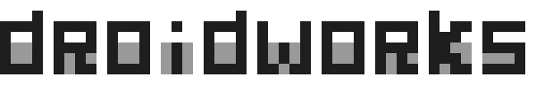

<picture>
  <source media="(prefers-color-scheme: dark)" srcset="assets/logo/droidworks-dark.svg">
  <source media="(prefers-color-scheme: light)" srcset="assets/logo/droidworks-light.svg">
  
</picture>

# Droidworks

Public tools and extensions for agentic software development.

Focused on making coding agents better at real software work: sharper tools, less noise, and workflows that stay out of the way. Custom builds and integrations are shaped and tested in real agentic workflows.

## Projects

- **[Pi](pi/)** — local Pi customization with theme-aware fullscreen selection and version-guarded patching.
- **[Pi Footer Nerd Fonts](pi-footer-nerdfonts/)** — replaces Pi footer emojis with consistent Nerd Font glyphs.
- **[Pi JEV Tools](pi-jev-tools/)** — just-in-time skill and tool selection for Pi's first turn; measured window breakdown, port design, benchmark plan.
- **[TokenJuice + RTK](tokenjuice-rtk/)** — agent-harness integration that coordinates two token-saving tools, providing layered output optimization without double processing.
- **[Open-source contributions](OPEN-SOURCE.md)** — the path from local workflow improvements to tested upstream contributions.
